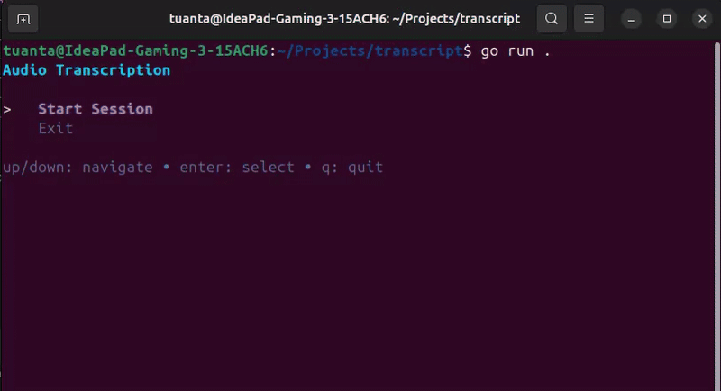

# Ekko

A real-time desktop audio transcription application with a clean TUI interface. Transcribe your system audio on the fly using Google's Gemini API.



> Darts scene from Ted Lasso (2x speed)

## Quick Start

```sh
make dev
```

### Prerequisites

Run the script below to install required dependencies

```bash
# Install required dependencies
./install.sh
```

This will install:

- `pulseaudio-utils` - For audio capture
- `ffmpeg` - For audio processing

## Configuration

Environment variables

| Variable         | Description           | Values              |
|------------------|-----------------------|---------------------|
| TRANSCRIBER_MODE | Transcription backend | `gemini`, `whisper` |
| GEMINI_API_KEY   | Google Gemini API key | Your API key        |

### Get a Gemini API Key

- Visit [Google AI Studio](https://aistudio.google.com/app/api-keys)
- Create a new API key
- Add it to your `.env` file

## Todo List

- [x] Add support for local whisper models
- [x] Custom recording chunk duration settings
- [ ] Concurrent audio transcription
- [ ] Real-time word highlighting

